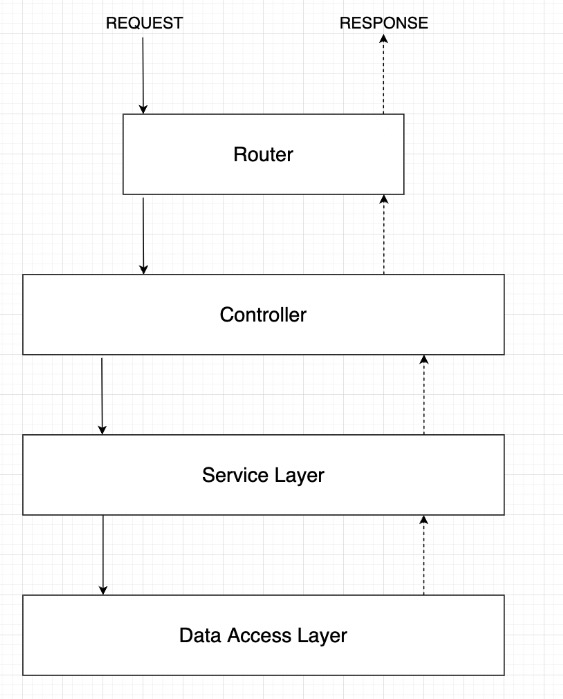

# REST API with Node.js, Express, Mongoose, MongoDB, Bcrypt, JWT...

### What concepts have I learned by building this REST API?
- REST API
- JWT & Refresh Tokens
- Request Validation
- MongoDB Models / Mongoose
- Express Middleware

### Technologies
- Node.js
- MongoDB w/ Mongoose
- Express.js + middleware

## Requirements 
- TBC

### Architecture for the data flow of the REST API

